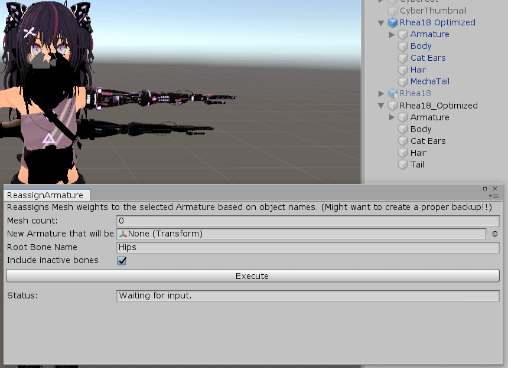

# Why?

Reassigns Mesh weights to the selected Armature based on object names.

You know, when you tweak your Dynamic Bones in Blender and then your avatar is all messed up if you try to just replace the mesh on already configured avatar.

Without this tool you'd have to re-configure your avatar from scratch on the new model.

# How?

Clone this repo into your Assets folder and open the interface from the top menu `Mesh+Bones`.

If you have multiple meshes using the same Armature on the model, just increase the count to the appropriate value and assign them all.

